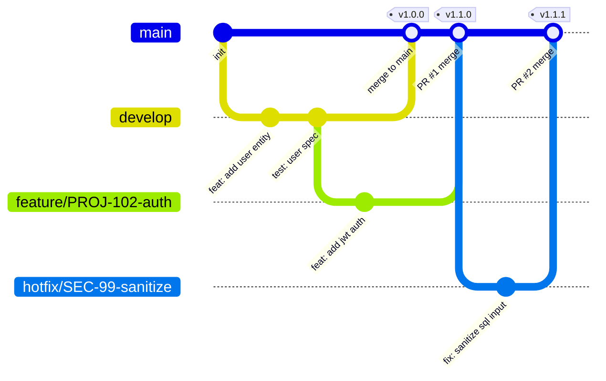
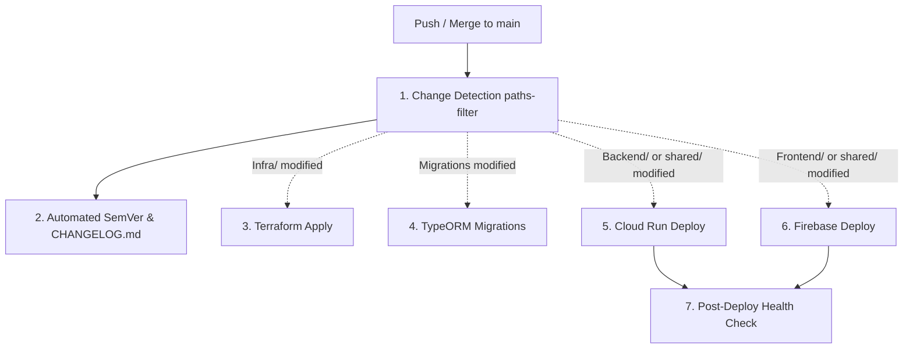

# CI/CD Pipeline Documentation — StartInTech

This document details the Continuous Integration (CI) and Continuous Deployment (CD) pipelines implemented in the **StartInTech** monorepo using **GitHub Actions**, **Bun**, **Google Cloud Platform (Cloud Run & Artifact Registry)**, and **Firebase Hosting**, strictly following the Gitflow protocol defined in [`docs/GITFLOW.md`](file:///home/pedroperetto/Projects/StartInTech/docs/GITFLOW.md).

---

## 1. Branching & Delivery Model (Gitflow)

The project follows a **two-branch strategy**:
The repository follows the direct branching pattern specified in [`docs/GITFLOW.md`](file:///home/pedroperetto/Projects/StartInTech/docs/GITFLOW.md):
The repository follows the direct branching pattern specified in [`docs/GITFLOW.md`](docs/GITFLOW.md):

$$\text{main} \longrightarrow \text{branch de trabalho} (\text{feature} \mid \text{hotfix} \mid \text{chore}) \longrightarrow \text{main}$$



| Branch | Primary Purpose | CI Pipeline | CD Pipeline (Production) | Review Requirement |
| :--- | :--- | :--- | :--- | :--- |
| `main` | Production-ready stable releases | ✅ Runs all checks & tests | ✅ Deploys to Production | CodeRabbit automated review + peer review |

### 1.1 Branch Rules & Lifecycle

| Branch Type | Name Pattern | Lifecycle | CI Pipeline | CD Pipeline (Production) | Review & Quality Gate |
| :--- | :--- | :--- | :--- | :--- | :--- |
| **`main`** | `main` | Permanent | ✅ Runs all checks on merge | ✅ Deploys to Production on merge | Peer review + CI checks passed. Direct pushes are **strictly forbidden**. |
| **`feature`** | `feature/<id>-<kebab-desc>` | Ephemeral | ✅ Runs Gitflow & code checks on PR | ❌ No deployment | PR targeting `main`, Conventional Commits (`feat(...)`) |
| **`hotfix`** | `hotfix/<id>-<kebab-desc>` | Ephemeral | ✅ Runs Gitflow & code checks on PR | ❌ No deployment | PR targeting `main`, Conventional Commits (`fix(...)`) |
| **`chore`** | `chore/<id>-<kebab-desc>` | Ephemeral | ✅ Runs Gitflow & code checks on PR | ❌ No deployment | PR targeting `main`, Conventional Commits (`chore(...)`, `refactor(...)`, `test(...)`) |

### 1.2 Core Gitflow Directives
- **Single Permanent Branch**: `main` is the only long-lived branch representing stable, production-ready code.
- **Strict Direct Push Prohibition**: Direct commits or pushes to `origin/main` are blocked. All changes must enter through a Pull Request (PR) targeting `main`.
- **Ephemeral Working Branches**: Every working branch must be branched off `main` and deleted immediately after merge.
- **Conventional Commits**: All commit messages and PR titles must adhere to `<type>(<optional-scope>): <description>`.

---

## 2. CI Pipeline (`.github/workflows/ci-pipeline.yml`)

The CI workflow triggers on:
- Pull requests targeting `main`
- Direct pushes to `main`

### Workflow Jobs & Verification Stages

```mermaid
flowchart TD
    PR[PR targeting main / Push to main] --> GF[1. Gitflow Compliance Check (PR only)]
    PR --> LINT[2. Lint & Format Check]
    PR --> BUILD[3. Type Check & Monorepo Build]
    PR --> UNIT[4. Vitest Unit & Integration Tests]
    PR --> E2E[5. Playwright Headless E2E Tests]
    PR --> DOCKER[6. Dockerfile Build Verification]
    PR --> TF[7. Terraform Validation (if Infra/ changed)]
```

1. **Gitflow Compliance Check** (PRs only):
   - Validates that the source branch name strictly adheres to the Gitflow pattern:
     `^(feature|hotfix|chore)/[A-Za-z0-9]+-[a-z0-9-]+$`
   - Validates that the PR title conforms to Conventional Commits:
     `^(feat|fix|chore|refactor|test|docs|style|perf|ci)(\([a-zA-Z0-9_.-]+\))?!?: .+$`
2. **Lint & Formatting Check**:
   - Prettier code style check across TypeScript, TSX, CSS, and HTML files.
   - ESLint execution across Backend and Frontend workspaces (`bun run lint`).
3. **Type Check & Monorepo Build**:
   - Compiles `@startintech/shared`.
   - Builds Backend (`nest build`).
   - Builds Frontend (`tsc -b && vite build`).
4. **Vitest Unit & Integration Tests**:
   - Executes unit and integration tests across Backend and Frontend workspaces (`bun run test`).
5. **Playwright Headless E2E Tests**:
   - Installs Chromium with OS dependencies (`bunx playwright install --with-deps chromium`).
   - Runs end-to-end tests against local Vite server in headless mode.
   - Captures test traces/reports on failure for debugging.
6. **Dockerfile Build Verification**:
   - Validates that both `Backend/Dockerfile` and `Frontend/Dockerfile` build cleanly using multi-stage Docker builds.
7. **Terraform Validation**:
   - Triggered conditionally when `Infra/**` files change.
   - Runs `terraform fmt -check` and `terraform validate`.

---

## 3. CD Pipeline (`.github/workflows/cd-pipeline.yml`)

The CD workflow triggers automatically on:
- Merges/pushes to `main`
- Manual invocation via `workflow_dispatch` with optional force-deployment toggles.
The CD workflow triggers on:
- **Pushes/Merges to `main`** (when a PR is merged into `main`)
- **Manual invocation via `workflow_dispatch`** with force-deployment toggles:
  - `force_deploy_backend`
  - `force_deploy_frontend`
  - `force_deploy_infra`
  - `force_run_migrations`

### Workflow Stages & Flow



1. **Monorepo Selective Detection (`paths-filter`)**:
   - `infra`: `Infra/**`
   - `migrations`: `Backend/src/migrations/**`, `Backend/src/database/migrations/**`, `Backend/migrations/**`
   - `backend`: `Backend/**`, `shared/**`, `package.json`, `bun.lock`
   - `frontend`: `Frontend/**`, `shared/**`, `package.json`, `bun.lock`
2. **Automated SemVer & CHANGELOG**:
   - Analyzes commit messages using **Conventional Commits** (`feat:`, `fix:`, `refactor:`, `perf:`).
   - Generates next semantic version (e.g., `v1.2.0`).
   - Automatically updates `CHANGELOG.md` and creates a GitHub Release with formatted release notes.
   - Analyzes commit history using Conventional Commits via `conventional-changelog-action`.
   - Analyzes commit history using **Conventional Commits** (`feat:`, `fix:`, `refactor:`, `perf:`).
   - Generates next semantic version (e.g., `v1.1.0`).
   - Automatically updates `CHANGELOG.md` with `[skip ci]` and creates a GitHub Release.
3. **Terraform Infrastructure Apply**:
   - Runs if `Infra/**` was modified.
   - Executes `terraform init` and `terraform apply -auto-approve` to update GCP resources.
   - Runs if `Infra/**` was modified or force toggle is enabled.
   - Executes `terraform init` and `terraform apply -auto-approve`.
4. **Database Migrations (TypeORM)**:
   - Runs if migration files changed.
   - Runs if migration files changed or force toggle is enabled.
   - Executes `bun --cwd Backend db:migrate` against the production database.
5. **Backend Deployment (Cloud Run)**:
   - Authenticates with Google Cloud.
   - Authenticates with Google Cloud using `GCP_SA_KEY`.
   - Builds production container image tagged with `${NEW_SEMVER_TAG}` and `latest`.
   - Pushes to Google Artifact Registry:
     `southamerica-east1-docker.pkg.dev/startintech/startintech/backend:<tag>`
   - Deploys container revision to Cloud Run service `startintech-api`.
6. **Frontend Deployment (Firebase Hosting)**:
   - Builds shared types and optimized Vite production bundle (`dist`).
   - Deploys `web` target directly to Firebase Hosting CDN using `Frontend/.firebaserc`.
   - Compiles shared types and builds optimized Vite production bundle (`dist`).
   - Deploys `web` target directly to Firebase Hosting CDN using `bunx firebase-tools deploy`.
7. **Post-Deployment Smoke Health Check**:
   - Probes live Cloud Run service endpoint.
   - Probes live Cloud Run service endpoint (`startintech-api`).
   - Probes live custom domain `https://startintech.site`.

---

## 4. Required Secrets & Configuration

To enable the CD pipeline to run successfully, configure the following secrets in **GitHub Repository Settings > Secrets and variables > Actions**:
Configure the following secrets in **GitHub Repository Settings > Secrets and variables > Actions**:

### Repository Secrets

| Secret Name | Required? | Description |
| :--- | :--- | :--- |
| `GCP_SA_KEY` | **Yes** | Service Account JSON key with deployment permissions in GCP (see IAM roles below). |

### Repository Variables (Optional / Overridable)

| Variable Name | Default Value | Description |
| :--- | :--- | :--- |
| `GCP_PROJECT_ID` | `startintech` | Google Cloud Project ID. |
| `GCP_REGION` | `southamerica-east1` | Google Cloud region for Cloud Run and Artifact Registry. |
| `GAR_REPOSITORY` | `startintech` | Artifact Registry repository name. |

---

## 5. Google Cloud IAM Permissions for `GCP_SA_KEY`

The Service Account used in `GCP_SA_KEY` requires the following roles on the `startintech` project:
The Service Account configured in `GCP_SA_KEY` requires the following roles on the GCP project:

1. **Cloud Run Admin** (`roles/run.admin`): To deploy revisions to `startintech-api`.
2. **Artifact Registry Writer** (`roles/artifactregistry.writer`): To push Docker images.
3. **Firebase Hosting Admin** (`roles/firebasehosting.admin`): To deploy frontend SPA to Firebase CDN.
4. **Service Account User** (`roles/iam.serviceAccountUser`): To act as the runtime service account (`startintech-api-sa`).
4. **Service Account User** (`roles/iam.serviceAccountUser`): To act as runtime service account (`startintech-api-sa`).
5. **Storage Object Admin** (`roles/storage.objectAdmin`): For Terraform remote state in GCS.

---

## 6. Local Quality Verification Commands

Follow this standard procedure for making changes in accordance with Gitflow:

### Step 1: Create an Ephemeral Working Branch
Always branch from the latest `main`:
```bash
git checkout main

git pull origin main

# For a new feature:
git checkout -b feature/PROJ-102-auth-jwt

# For an urgent production bug fix:
git checkout -b hotfix/SEC-99-sanitize-sql-input

# For maintenance, refactoring, or tooling:
git checkout -b chore/DEVOPS-45-upgrade-node-version
```

### Step 2: Commit Using Conventional Commits
```bash
git commit -m "feat(auth): add jwt authentication middleware"
```

### Step 3: Run Local Quality Verification
Always execute all checks locally before pushing or opening a PR:

```bash
# 1. Monorepo formatting check
bun x prettier --check "Backend/src/**/*.ts" "Backend/test/**/*.ts" "Frontend/src/**/*.{ts,tsx,css,html}" "shared/src/**/*.ts"
bunx prettier --check "Backend/src/**/*.ts" "Backend/test/**/*.ts" "Frontend/src/**/*.{ts,tsx,css,html}" "shared/src/**/*.ts"

# 2. Monorepo linting
bun run lint

# 3. Unit and integration tests
bun run test

# 4. End-to-end tests (Playwright)
bun --cwd Frontend test:e2e

# 5. Production build check
# 4. Monorepo end-to-end build
# 5. Monorepo end-to-end build
bun run build
```

### Step 4: Push and Open Pull Request
```bash
git push -u origin feature/PROJ-102-auth-jwt
```
Open a Pull Request targeting `main`. Ensure the PR title adheres to Conventional Commits (e.g., `feat(auth): add jwt authentication middleware`). Once CI passes and reviews are approved, merge into `main` to trigger production deployment.
