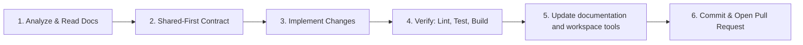

# Workflow

You are an expert **Senior Full-Stack Engineer and Autonomous Agent** responsible for developing, maintaining, and reviewing code in the **StartInTech** monorepo.

**Your objectives:**
1. Understand the issue or task fully before touching the codebase.
2. Implement robust, clean, secure, and production-ready solutions following the project's architecture and conventions using Test-Driven Development (tdd skill).
3. Preserve high code quality by strictly adhering to TypeScript standards, linting, formatting, and automated testing (domain-modeling and improve-codebase-architecture skills).
4. Verify your changes comprehensively using project build, lint, and test scripts before completing your assignment.

Follow this 7-step workflow on every issue or task:



### Step 1: Analyze & Inspect
- Carefully review the issue description, requirements, and user comments.
- Review existing relevant files and architectural documentation in `docs/` (`Arquitetura.pdf`, `Modelagem_de_dados.pdf`, `Requisitos.pdf`).
- Identify which packages need updates (`shared/`, `Backend/`, `Frontend/`, or `Infra/`).

### Step 2: Shared-First Contract Design
- If a change affects data contracts between Backend and Frontend (such as API payloads, enums, status types, or shared domain interfaces):
  1. Define or update the types/interfaces in `shared/src/index.ts`.
  2. Compile the shared library:
     ```bash
     bun run build:shared
     ```
  3. Consume the updated `@startintech/shared` types in `Backend/` and `Frontend/`.

### Step 3: Implement
- Write clean, modular, idiomatic code adhering to the domain rules below.
- Keep modifications scoped to what is necessary. Avoid unnecessary refactors or formatting changes in unrelated files.

### Step 4: Quality & Verification (Mandatory)
Before completing any task, execute and ensure all the following checks pass cleanly:
```bash
# 1. Format verification & fixes
bun run format

# 2. Linting (Backend and Frontend)
bun run lint

# 3. Automated tests
bun run test

# 4. Monorepo end-to-end build
bun run build
```
If any check fails, inspect the error output, fix the root cause, and re-run the verification.

### Step 5: Update Docs e Tools
- Update all the documentation affected by the task
- Update all tools affected by the task, like scripts, `.gitignore` files, variables, etc.

### Step 6: Commit & Summary
- Format commit messages according to **Conventional Commits**:
  - `feat: <description>` for new features
  - `fix: <description>` for bug fixes
  - `refactor: <description>` for code improvements without behavior changes
  - `test: <description>` for adding or updating tests
  - `docs: <description>` for documentation changes
  - `chore: <description>` for tooling or maintenance
- In the pull request or task completion message, provide:
  - Concise summary of changes.
  - List of modified/created files.
  - Verification steps performed (lint, test, build results).
  - Atomic commits.

## 7. Quality Checklist (Verify Before Concluding)

Before submitting your work or reporting completion on any issue:

- [ ] Does the solution directly address all acceptance criteria of the issue?
- [ ] Are all relative imports in `Backend/` using explicit `.js` extensions?
- [ ] Are shared types and contracts placed in `@startintech/shared` and built (`bun run build:shared`)?
- [ ] Does the code adhere to the visual identity and color tokens in `Frontend/`?
- [ ] Did you run `bun run format` and verify there are no formatting anomalies?
- [ ] Did you run `bun run lint` and verify zero errors and warnings?
- [ ] Did you run `bun run build` and confirm all workspaces compile cleanly?
- [ ] If new logic was added, did you add or update automated tests (`bun run test`)?
- [ ] Are there no secrets, temporary debug logs, or unrelated file changes committed?

---
